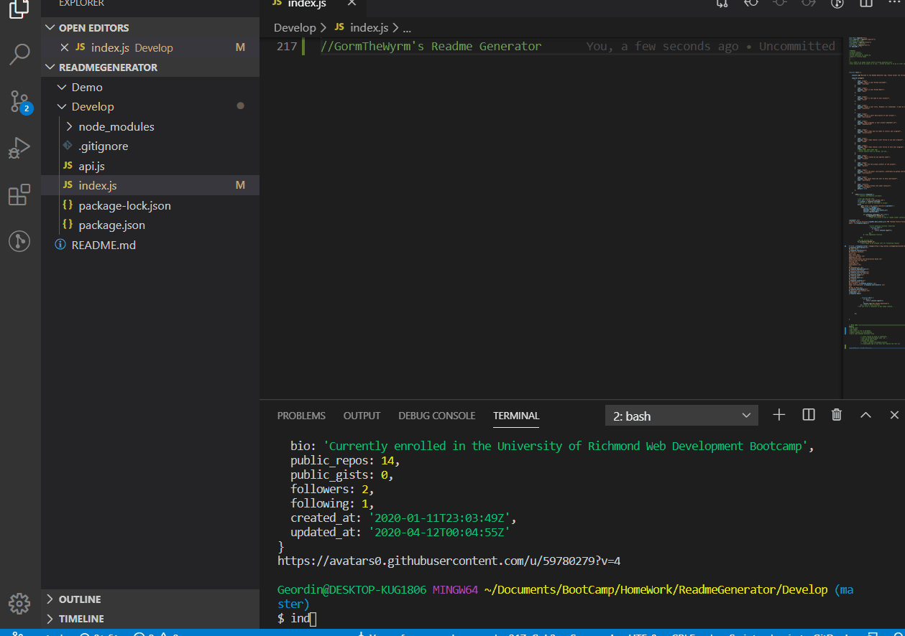

# Title: Readme Generator

This project uses the command line and inquirer to prompt users with questions in order to generate a readme file. The readme is written to a file called "NewReadme"  

## User Story  

As a developer, I want an app to walk me through creating a readme file.

## Table of Contents:  

[Title](#title)  
[User-Story]()  
[Table-of-Contents]()  
[Dependencies]()  
[Setup-Instructions-and-Installation-Guide]()  
[Instructions for Use]()  
[Testing]()  
[Licensing]()  
[Contributors]()  
  

## Dependencies  
This project uses node.js, inquirer and axios. It was written using visual studios code.

## Installation Guide: 
clone repo, open index.js in terminal, run "npm init", "npm i" and hope for the best  

## Instructions for Use: 
  Clone Github Repo, open index.js in terminal, run " node index.js "  
  note that github username is required or app will not work
     
    

## Testing: 
No automated testing files are associated with this project

## License: 
Standard Copyright rules apply. Feel free to use the product to generate a readme file for your own projects.  

## Contributors:  
Main Authors: GormTheWyrm  

Other Contributions: Special thanks to University of Richmond and Trilogy Education Services
  
